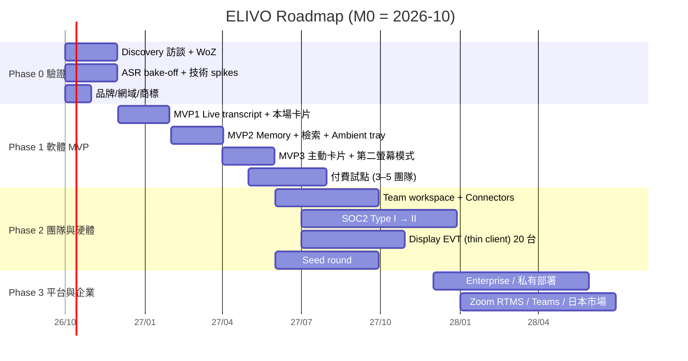

# ELIVO 專案計劃（v1，修訂版）

> 狀態：v1（2026-09-29）｜取代原計劃書中的定位、產品形態、商業模式與路線圖段落；品牌精神與願景保留。
> 依據：[`01-research-report.md`](01-research-report.md)

---

## 1. 修訂後的定位

### 1.1 一句話

> **ELIVO 在會議進行中，安靜地把「現在說的話」和「過去的決策、數字、文件」連起來——只在真正重要時提醒你，而且每一則都附來源。**

英文：*ELIVO quietly connects what's being said to what was decided — and speaks up only when it matters.*

### 1.2 產品類別

- **對外**：Real-time Conversation Intelligence（沿用）
- **對投資人與企業**：**Meeting Memory & Decision Consistency**，也就是會議中的組織記憶與決策一致性

### 1.3 與原計劃書的差異

| 項目 | 原計劃 | 修訂 |
|---|---|---|
| 核心價值 | 即時理解會議 | **即時 × 跨會議決策帳本**（帳本是價值來源，即時是交付方式） |
| 差異化順序 | Real-time → Context → Presence → Low-interruption | ① 帶來源的主動洞察 ② Decision Ledger ③ 安靜設計 ④ 華語與信任 ⑤ 實體存在感 |
| 第一個產品 | Mac App → Display | Mac App（bot-free）＋ **iPad／第二螢幕模式** → Display |
| 灘頭市場 | 顧問、Sales、研究、企業並行 | **台灣 B2B 顧問與客戶經理／PM**（單人付費）→ 其所屬團隊 → Sales → 企業 |
| 冷啟動 | 未提及 | 零歷史時也有價值：本場狀態卡、會前簡報、匯入既有資料 |
| 信任 | 企業版才提 | **從第一天開始**：不訓練、看得到的告知、Ephemeral mode、不做聲紋與情緒辨識 |

### 1.4 保留不變的品牌精神

- 意聯＝Connecting Meaning；*From Conversation to Understanding.*
- *Listen less like a recorder. Understand more like a participant.*
- *The best AI intervention is the one that appears exactly when needed.*
- 讓 AI 理解對談，讓人專注於對談。

---

## 2. 目標用戶（灘頭）

### 2.1 主要 Persona：「多客戶的 B2B 專業工作者」

- **職位**：管理顧問、IT／數位轉型顧問、B2B 客戶經理（AM）、專案經理、售前工程師。
- **場景**：每週 10–25 場會議；同時服務 3–10 個客戶或專案；遠端與面對面混合；常在**客戶的平台**上開會（Teams、Meet、Zoom 都有）；中文夾英文術語。
- **痛點**：
  - 「上次跟這個客戶談到哪？」要靠記憶，或會前花 15 分鐘翻筆記。
  - 會中聽到數字、承諾，無法即時確認是否和先前一致。
  - 會後追蹤信與待辦要手動整理。
- **付費能力**：個人可報帳 NT$500–1,000／月的工具；團隊預算由 practice lead 決定。

### 2.2 第二波

- **B2B Sales**（ROI 明確，需 CRM 整合）
- **使用者研究與訪談研究者**
- **企業內部專案團隊**（跟著 Team 方案進來）

### 2.3 暫不服務

- 中國用戶（PIPL 跨境規範）
- 政府機關（需地端、採購週期長）
- 客服中心（Cresta 等已成熟）
- 學生（付費意願低、學校禁用潮）

---

## 3. 產品路線圖

時間基準：自 2026 年 10 月起（M0＝2026/10）。

### Phase 0｜驗證（M0–M2，2026/10–11）

**目標**：在寫大量程式之前，先驗證三個前提條件（C1–C3，見研究報告 §10）。

| 工作項 | 產出 |
|---|---|
| 25+ 位目標用戶訪談（Mom Test） | 痛點地圖、付費意願、禁用與告知的實況 |
| **Wizard-of-Oz**：真人分析師在 20–30 場真實會議中，推送卡片到 iPad 或第二螢幕 | 每張卡片的有用度標註、干擾度、理想頻率 → 形成 **Insight Taxonomy v1** 與 gold 資料 |
| ASR bake-off（5 家雲端 + Breeze 本地） | ADR：主與備用 ASR 供應商 |
| Core Audio tap 原型、Tier-1 抽取原型 | 技術 spike 報告 |
| 網域註冊、TIPO 商標檢索、備選名稱 | 品牌風險清單 |
| Landing page（中英）＋ waitlist | 需求訊號 |

**Gate 0（M2 結束時）**：C1–C3 通過 → 進入 Phase 1；否則依研究報告 §10 的規則 pivot。

### Phase 1｜軟體 MVP（M2–M8，2026/12–2027/5）

詳細規格見 [`04-mvp-spec.md`](04-mvp-spec.md)。

| 版本 | 期間 | 內容 | 對象 |
|---|---|---|---|
| **MVP1「Live」** | M2–M4 | macOS app（bot-free 擷取）、即時逐字稿（繁中與中英混說）、**本場狀態卡**（未回答問題、無 owner 待辦、數字追蹤）、會後摘要與決策確認 | Private alpha：10–20 人 |
| **MVP2「Memory」** | M4–M6 | Decision Ledger、Client／Project Spaces、匯入文件與過去的逐字稿、hybrid 檢索、**Ambient tray**（相關文件、先前決策）、會前簡報 | Closed beta：50 人 |
| **MVP3「Surface」** | M6–M8 | **主動卡片**（決策衝突、數字差異、指代消解）、surfacing policy v1、**第二螢幕模式**（iPad／Web）、Ephemeral mode、ELIVO MCP server | Beta 100+ 人；付費試點 3–5 團隊 |

**Gate 1（M8）**：

| 指標 | 門檻 |
|---|---|
| Insight precision（使用者評為有幫助的比例） | ≥ 60% |
| False interruption rate | ≤ 1 次／會議小時 |
| W4 留存（每週 ≥3 場會議使用） | ≥ 40% |
| 付費轉換（beta → 付費） | ≥ 8% |
| 付費試點 | ≥ 3 個團隊簽約 |
| 「若不能再用會非常失望」（Sean Ellis 測試） | ≥ 40% |

### Phase 2｜團隊與硬體（M8–M14，2027/6–11）

- **Team workspace**：共享的 Spaces、權限、決策帳本共享、管理員保留政策。
- **Connectors**：Google Drive、Notion、M365（Graph）、Google／Outlook Calendar；CRM（HubSpot）作為 Sales 前導。
- **Windows 版**（依需求）。
- **信任**：SOC 2 Type I → Type II；SSO／SCIM；台灣區資料落地。
- **ELIVO Display EVT**：thin client（ESP32-S3 + XVF3800 + 電子紙或 LCD），20 台，只給付費試點客戶用於會議室場景；前提是第二螢幕模式的使用數據支持。
- **Seed 募資**（見 §6）。

**Gate 2（M14）**：ARR ≥ US$250k 或付費席次 ≥ 800；Display 試點 NPS ≥ 40；決定是否進入 DVT／量產。

### Phase 3｜平台與企業（M14+，2027/12 起）

- Enterprise：私有雲、地端部署（Edge 推論機 RK3588 或客戶 GPU）、稽核、DLP、法遵保留。
- 平台整合：Zoom RTMS、Teams app、Recall.ai（身分準確的 speaker）。
- 延伸場景：Sales Intelligence、Research Intelligence。
- 市場：日本（APPI、在地化、資料區）→ 新加坡（東南亞 hub）。
- 長期：Personal Conversation Memory、Enterprise Intelligence Layer（沿用原願景）。

---

## 4. 組織與分工

### 4.1 Phase 0–1 核心團隊（3–4 人）

| 角色 | 職責 | 備註 |
|---|---|---|
| 創辦人／CEO（產品） | 用戶訪談、WoZ 操作、定價、募資、BD | 需親自操作 WoZ，這是產品直覺的來源 |
| AI／Backend 工程師 | ASR gateway、抽取、檢索、surfacing policy、eval harness | Python；熟悉 LLM 與檢索 |
| macOS／Frontend 工程師 | Swift capture helper、Tauri + React UI、第二螢幕模式 | Swift + TypeScript |
| 產品設計師（兼職或約聘） | 「安靜」的 UI 語言、卡片設計、品牌視覺 | 品牌語言：spatial／information layer |

### 4.2 顧問與外部資源

- 法律顧問：台灣個資與通保、美國 CIPA／BIPA；Phase 1 前審閱告知範本與 ToS／DPA。
- 語音與 NLP 學界：可洽 MediaTek Research（Breeze）或台大、清大語音實驗室。
- 標註人員：WoZ 分析師與 gold 標註（時薪約聘）。

### 4.3 Phase 2 擴編（seed 後，7–10 人）

硬體工程（ODM 窗口）、第二位 AI 工程師、Solutions／CS、安全與合規（兼任）。

---

## 5. 預算（12 個月，Phase 0–1 至 Phase 2 初期）

> 粗估，以台灣薪資水準為準；幣別 NT$。

| 項目 | 12 個月估計 | 說明 |
|---|---|---|
| 人事（3 名工程與產品 + 兼職設計） | 6,500,000–8,500,000 | 含勞健保 |
| 雲端與 API（ASR、LLM、DB） | 400,000–800,000 | beta 期約 100 名活躍用戶 × 每月 30 會議小時 × 每小時 US$0.5 |
| WoZ 與標註 | 300,000–500,000 | 分析師、gold 逐字稿 |
| 法律、商標、網域 | 300,000–600,000 | 告知範本、ToS／DPA、TIPO 與 Madrid 商標申請 |
| 合規（Vanta／Drata + SOC 2 Type I） | 600,000–1,200,000 | 可延到 Phase 2 |
| 硬體 EVT（20 台 + 設計 + 預認證） | 800,000–1,500,000 | 僅在 Gate 1 通過後執行 |
| 設備、辦公、差旅、行銷 | 500,000–900,000 | |
| **合計** | **約 9.4M–14M（US$0.3–0.45M）** | |

---

## 6. 資金策略

| 階段 | 來源 | 金額 | 時點 |
|---|---|---|---|
| 自有 + 天使 | 創辦人、天使 | NT$3–5M | M0 |
| 政府補助 | **SBIR Phase 1**（2026 年起最高 NT$1.5M／6 個月，以簡報取代計畫書）→ Phase 2（最高 NT$6M／年） | NT$1.5M → 6M | M1 申請 |
| 地方補助 | 臺北市 SITI 創業補助（NT$1M，公司設立 <1 年）或研發補助（最高 NT$5M） | NT$1–5M | 設立後 |
| 加速器 | AppWorks（不取股）、Garage+、Taiwan Tech Arena；YC（以「會議中的決策一致性 agent」敘事申請） | 資源、人脈 | M2–M6 |
| **Seed** | 國發基金創業天使投資方案（每家最高 NT$20M，與大型機構共投最高 NT$30M）＋ 創投 | **US$1–2M** | M8–M12（Gate 1 之後） |

**Seed 故事線**：Gate 1 的數據（insight precision、留存、付費試點）+ Decision Ledger 的資料網路效應 + 台灣與 APAC 的信任定位 + 硬體選擇權。

---

## 7. 定價（v1 假說，將在 Phase 1 試點中驗證）

| 方案 | 價格 | 內容 |
|---|---|---|
| **Free** | NT$0 | 每月 300 分鐘、30 天歷史、本場狀態卡、會後摘要 |
| **Pro** | **NT$690／月**（年繳）、NT$790（月繳）；約 US$20–25 | 不限轉錄（fair use 60 hr／月）、Decision Ledger、Spaces、主動卡片、會前簡報、第二螢幕模式、Ephemeral mode |
| **Team** | **約 US$35–45／人·月** | 共享 Spaces 與帳本、Connectors、管理員政策、SSO（Team+） |
| **Enterprise** | 年約報價 | 私有雲或地端、稽核、DLP、資料落地、SLA、API／MCP |
| **Credits** | 依量計價 | 超量會議小時、大量文件索引、進階模型 |
| **ELIVO Display** | 以成本價綁年約 | 會議室或桌面的伴隨顯示器 + 麥克風陣列 |

---

## 8. 成功指標（North Star 與支撐指標）

- **North Star**：**每週被使用者「採用」的洞察數**。「採用」指 pin、展開來源、複製或加入追蹤；這比 DAU 更能反映核心價值。
- **品質**：Insight precision、False interruption rate、Decision extraction F1、MER、卡片延遲。
- **成長**：W4／W12 留存、每位使用者每週會議數、Free → Pro 轉換率、Team 擴散（單人 → 同團隊邀請數）。
- **信任**：告知被拒絕的比例、刪除請求處理時間、安全事件數（目標 0）。
- **營運**：每會議小時成本、毛利率。

---

## 9. 近期行動清單（接下來 2 週）

1. [ ] 註冊網域：elivo.tw、elivo.com.tw、getelivo.com（2026-09-29 時看起來未被註冊）；監看 **elivo.ai（2026-10-10 到期）**。
2. [ ] TIPO 商標檢索（第 9、42、35、38 類），列出 2–3 個備選名稱。
3. [ ] 招募 25 位訪談對象（顧問、AM、PM），排定訪談。
4. [ ] 準備 WoZ 工具：iPad 顯示頁 + 分析師推送介面 + 告知範本（中英）。
5. [ ] 收集 ASR 測試音檔（取得同意的內部與友好會議，目標 5–10 小時），開始人工校對。
6. [ ] 開 Soniox、ElevenLabs、Speechmatics、Deepgram、AssemblyAI 帳號，並簽署 zero-retention 條款（如可）。
7. [ ] 準備 SBIR Phase 1 簡報。
8. [ ] 法律顧問初談：台灣告知範本、presence gating、ToS 的「不訓練」條款。
